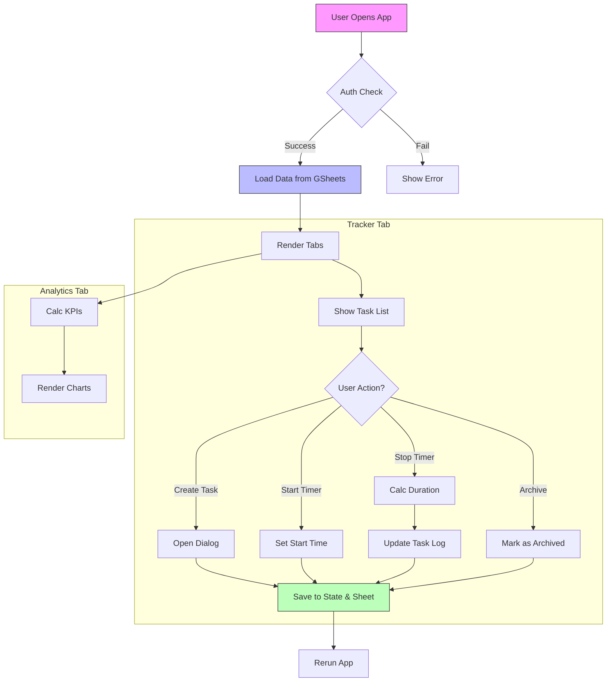

# 🖥️ Tasks Tracker

A minimalist, high-performance time tracking application built with **Streamlit** and **Google Sheets**.

 

## 📋 Overview
Tasks Tracker allows you to manage tasks, track time in real-time, and analyze your productivity through a unified, single-page interface. It is designed to be deployed in the cloud (Streamlit Community Cloud), ensuring your data is accessible 24/7 without depending on a local machine.

## 📂 Project Structure

| File | Description |
| :--- | :--- |
| **`app.py`** | The **core** of the application. Contains all the UI logic, state management, timer logic, and synchronization with Google Sheets. |
| **`requirements.txt`** | Lists the Python dependencies required to run the app (e.g., `streamlit`, `gspread`, `pandas`, `plotly`). |
| **`debug_auth.py`** | *Utility*. A script to test and verify Google Sheets authentication independent of the main app. |
| **`.streamlit/secrets.toml`** | *Sensitive*. Contains API keys and credentials. **Never commit this file**. |

## ✨ Key Features

### 1. ⏱️ Tracker (Main Tab)
- **Active Task Management**: Create, edit, and delete tasks.
- **Real-Time Timer**: Start/Stop tracking with a single click.
- **Categories**: Organize tasks by category (dynamically filtered).
- **Pixel-Perfect UI**: Integrated "New Task" dialog and unified toolbar.
- **Archive**: Move completed tasks out of view without deleting data.

### 2. 📊 Analytics
- **Visual Insights**: Charts and KPIs to visualize performance.
- **Category Breakdown**: See where your time goes.
- [Coming Soon] **Advanced Suite**: Sankey diagrams and Heatmaps (part of the "Time Auditor" roadmap).

### 3. 📜 Logs
- **Raw Data View**: Inspect every time session recorded.
- **Manual Data Override**: Force refresh from Google Sheets if you made external edits.
- **Excel Export**: Download your data for offline analysis.

## 🔄 Application Flow



## 🚀 Setup & Deployment

1.  **Clone the Repo**:
    ```bash
    git clone https://github.com/manvgom/AG.git
    cd AG
    ```
2.  **Install Dependencies**:
    ```bash
    pip install -r requirements.txt
    ```
3.  **Configure Secrets**:
    Create `.streamlit/secrets.toml` with your Google Service Account credentials.
4.  **Run Locally**:
    ```bash
    streamlit run app.py
    ```
5.  **Deploy**:
    Push to GitHub and connect via [Streamlit Community Cloud](https://share.streamlit.io/).
